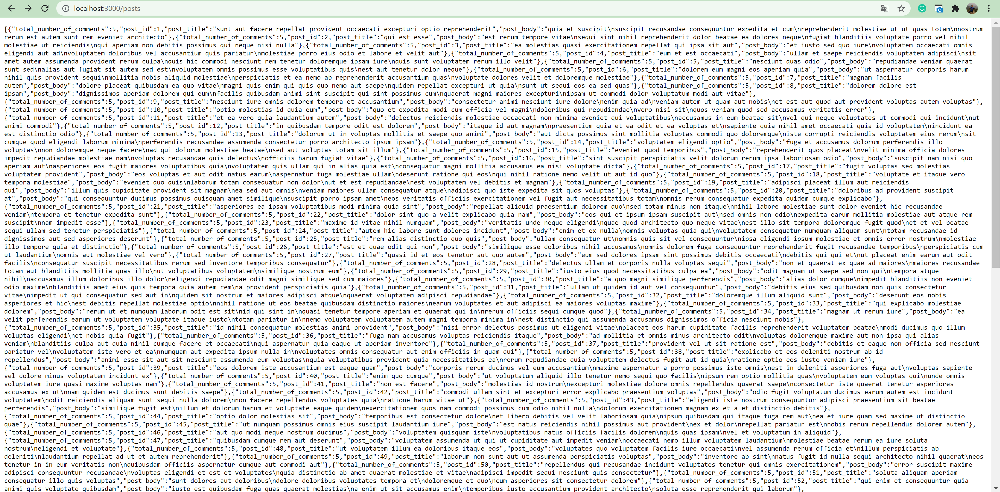

# nodejs - rest - api

## Setup
1. Run`npm install`
2. Run `npm run start`

## Question 1
Go to`http://localhost:3000/posts` to retrieve post list with total number of comments.

### example output

## Question 2
Go to`http://localhost:3000/comments?body=:comment` to retrieve comment list based on searched words.

### example output

